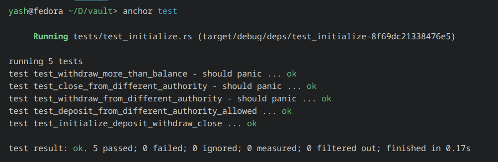

# Vault Program

An Anchor program that teaches the core Solana vault pattern: create a program-derived address for vault state, deposit lamports into a vault PDA, withdraw them back with authority checks, and close everything cleanly when the vault is no longer needed.



## What this project does

The program keeps two linked accounts:

- A `VaultState` account that stores the owner and the PDA bumps.
- A vault PDA that actually holds the lamports.

That split is useful because the state account gives the program a stable place to record who owns the vault, while the vault PDA stays as a simple SOL bucket controlled by the program.

## How it works

The account layout is intentionally simple:

- `initialize` creates the state account and stores the authority.
- `deposit` lets any signer move SOL into the vault PDA.
- `withdraw` sends SOL out of the vault, but only when the signer matches the stored authority and the vault stays rent exempt.
- `close` drains the vault and closes the state account, returning remaining lamports to the authority.

The seed scheme is:

- `vault_state = PDA("vault", authority)`
- `vault = PDA("vault", vault_state)`

Because both addresses are derived from seeds, the program can re-check them on every instruction instead of trusting client-provided keys.

## Account Model

### `VaultState`

`VaultState` stores the minimum metadata needed to safely manage the vault:

- `authority`: the wallet allowed to withdraw and close the vault.
- `state_bump`: the bump for the state PDA.
- `vault_bump`: the bump for the vault PDA.

### Vault PDA

The vault PDA is just the lamport holding account. It does not store extra business data. That keeps the design easy to reason about and makes the vault balance the source of truth for funds.

## Instruction Flow

### Initialize

Initialization creates the state account with Anchor’s `init` constraint. The handler stores the authority and both PDA bumps so future instructions can re-derive the same addresses.

### Deposit

Deposits use a CPI to the system program. The signer pays the lamports, but the vault PDA receives them. This means any wallet can fund the vault, not just the owner.

### Withdraw

Withdrawals are protected by a `has_one = authority` check and a rent-exemption guard. The authority must sign, and the vault must keep enough lamports to remain valid after the transfer.

### Close

Closing first drains the vault PDA, then Anchor closes the state account and sends its lamports back to the authority. That leaves no active vault state behind.

## Project Structure

- `programs/vault_program/src/lib.rs` exposes the program entrypoints.
- `programs/vault_program/src/instructions/` contains the account validation and instruction logic.
- `programs/vault_program/src/state.rs` defines the persisted vault state.
- `programs/vault_program/src/error.rs` defines custom error codes.
- `programs/vault_program/tests/test_initialize.rs` exercises the full initialize/deposit/withdraw/close flow with LiteSVM.

## Running It

Build and test with Anchor’s default test command:

```bash
anchor test
```

If you want to run just the Rust tests for the program package, use:

```bash
cargo test -p vault_program
```

## Notes

- The program is configured for localnet in `Anchor.toml`.

- The test suite uses the compiled program artifact from `target/deploy/vault_program.so`, so make sure the program has been built before running the integration test directly.